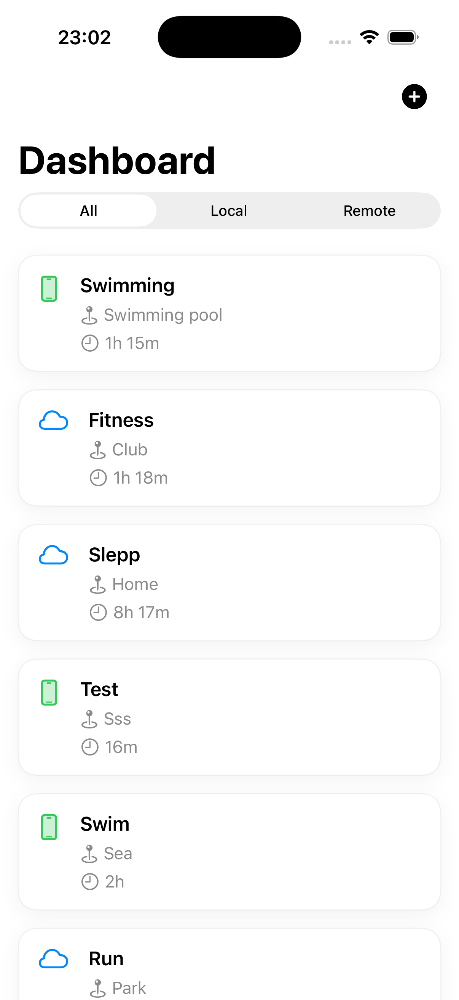
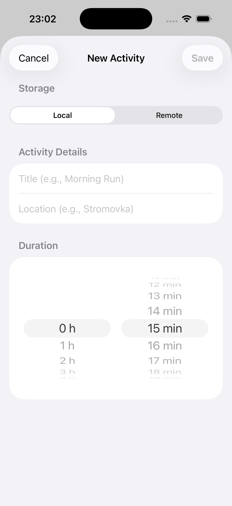

# SportTracker

A native iOS application for recording and tracking sporting activities, built with SwiftUI and supporting both local (SwiftData) and remote (Firebase Firestore) storage.

---

## Features

- Record sport activities with a title, location, and duration
- Choose storage destination per activity: **Local** (on-device) or **Remote** (Firebase)
- View all recorded activities on the Dashboard, filterable by storage type (All / Local / Remote)
- Color-coded activity cards: green icon for local records, blue for remote
- Graceful handling of network errors — local data is always shown even if Firebase is unavailable
- Fully supports both **portrait** and **landscape** orientations
- No Storyboards or XIBs — 100% SwiftUI

---

## Screens

<p align="center">
  
  &nbsp;&nbsp;&nbsp;
  
</p>

### 1. Dashboard

The main screen that displays all recorded activities.

- A **segmented Picker** at the top lets the user filter records: `All | Local | Remote`
- Each activity is shown as a card with its title, location, duration, and a storage-type icon
- An **Add** button (`+`) in the navigation bar opens the form sheet
- Shows a loading indicator while fetching data
- If Firebase is unreachable, an alert warns the user and local records are still displayed
- Empty state message when no records match the current filter

### 2. Activity Form (sheet)

Presented as a bottom sheet from the Dashboard.

- **Storage selector** (segmented, at the top): choose `Local` or `Remote` before filling in details — intentionally placed first so the user decides destination upfront
- **Title** — text field
- **Location** — text field
- **Duration** — double wheel picker (hours + minutes), minimum value > 0 required
- **Save** button is disabled until the form is valid (non-empty title, non-empty location, duration > 0)
- Loading overlay shown while saving; error message displayed inline on failure
- On successful save the sheet is dismissed and the Dashboard reloads automatically

---

## Navigation Flow

```
App Start
    └── DashboardView (NavigationStack)
            ├── Loads and displays activities
            ├── Filter picker (All / Local / Remote)
            └── Tap "+" → ActivityFormView (sheet)
                        ├── Fill in details
                        ├── Tap Save → persist → dismiss sheet
                        └── Tap Cancel → dismiss sheet
                               └── Dashboard auto-refreshes
```

**Why this flow?**

Using a **modal sheet** for the form (rather than a push navigation) clearly communicates that the user is in a transient input mode and will return to the same dashboard state after saving or cancelling. This also works naturally in both portrait and landscape, as sheets scale correctly on all devices.

---

## Architecture

The project follows a layered **MVVM + Repository** architecture, applied consistently across the entire codebase.

```
┌─────────────────────────────────────────┐
│              Presentation               │
│  View  ←→  ViewModel (send / state)     │
└────────────────┬────────────────────────┘
                 │ ActivityRepositoryProtocol
┌────────────────▼────────────────────────┐
│                 Data                    │
│  AppActivityRepository                  │
│    ├── SwiftDataService  (local)        │
│    └── FirestoreService  (remote)       │
└─────────────────────────────────────────┘
```

### State & Action pattern

Each ViewModel exposes a single `state` property and a `send(_ action:)` method, inspired by **TCA (The Composable Architecture)**. Views never mutate state directly — they only dispatch actions. This makes data flow unidirectional and predictable: the View describes what happened, the ViewModel decides how state changes.

```swift
// View dispatches an action
viewModel.send(.setFilter(.local))

// ViewModel owns all state transitions
enum Action { case onAppear, tapAddActivity, setFilter(ActivityFilter), ... }
enum State  { case loading, success([ActivityRecord], ...), error(String) }
```

This pattern also makes unit testing straightforward — tests simply send actions and assert on the resulting state without needing to interact with the UI.

### Key Design Decisions

| Layer | Choice | Reason |
|---|---|---|
| UI | SwiftUI `@Observable` ViewModels | Eliminates boilerplate vs `ObservableObject`; fine-grained dependency tracking |
| Local storage | SwiftData | Modern, first-party, no raw SQL; type-safe via `@Model` |
| Remote storage | Firebase Firestore | Serverless, no backend code required, real-time capable |
| Repository pattern | `ActivityRepositoryProtocol` | Decouples ViewModels from storage details; easy to mock in tests |
| Data source protocol | `ActivityDataSourceProtocol` | `SwiftDataService` and `FirestoreService` are interchangeable; swapping storage requires zero changes above |
| Error model | `RepositoryError.networkError(partialData:)` | Carries partial local data in the error so the UI can still render something useful |

---

## Project Structure

```
SoprtTracker/
├── SportTrackerApp.swift          # App entry point; dependency injection root
├── Core/
│   ├── Models/
│   │   ├── ActivityRecord.swift   # Domain model (pure Swift struct)
│   │   └── StorageType.swift      # Enum: .local / .remote
│   ├── Protocols/
│   │   ├── ActivityRepositoryProtocol.swift
│   │   └── ActivityDataSourceProtocol.swift
│   └── Errors/
│       └── RepositoryError.swift
├── Data/
│   ├── Models/
│   │   ├── LocalActivityModel.swift   # SwiftData @Model
│   │   └── RemoteActivityModel.swift  # Codable Firestore DTO
│   ├── Repositories/
│   │   └── AppActivityRepository.swift
│   └── Services/
│       ├── SwiftDataService.swift
│       └── FirestoreService.swift
├── Features/
│   ├── Dashboard/
│   │   ├── DashboardView.swift
│   │   └── DashboardViewModel.swift
│   └── ActivityForm/
│       ├── ActivityFormView.swift
│       └── ActivityFormViewModel.swift
└── CommonUI/
    └── ActivityCardView.swift     # Reusable card component

SoprtTrackerTests/
├── DashboardViewModelTests.swift
└── Data/Repositories/
    └── MockActivityRepository.swift
```

---

## Dependency Injection

All dependencies are assembled once at the app entry point (`SportTrackerApp.swift`) and passed down through initialisers — no singletons, no service locators. This makes every component independently testable.

---

## Testing

Unit tests cover `DashboardViewModel` using `MockActivityRepository`, which simulates both happy-path and error scenarios without touching any real storage.

| Test | What is verified |
|---|---|
| `testOnAppear_LoadsDataAndChangesStateToSuccess` | State transitions to `.success` with correct records |
| `testOnAppear_WithNetworkError_ShowsAlertAndKeepsLocalData` | Network error triggers warning alert and partial data is shown |
| `testTapAddActivity_SetsDestinationToForm` | Correct destination is set when Add is tapped |
| `testDismissForm_ClearsDestinationAndReloadsData` | Destination cleared and data reloaded after form dismissal |
| `testSetFilter_UpdatesStateWithFilteredRecords` | Filter action correctly narrows displayed records |
| `testDismissWarningAlert_RemovesWarningButKeepsData` | Dismissing the alert clears the message without losing records |

---

## Tech Stack

| Technology | Version / Notes |
|---|---|
| Swift | 5.9+ |
| SwiftUI | iOS 17+ (`@Observable`, `ContentUnavailableView`) |
| SwiftData | iOS 17+ |
| Firebase iOS SDK | Firestore |
| Minimum deployment target | iOS 17 |

---

## Setup

1. Clone the repository.
2. Open `SportTracker.xcodeproj`.
3. Add your own `GoogleService-Info.plist` from the [Firebase Console](https://console.firebase.google.com/) to the `SoprtTracker/` folder (replace the existing placeholder).
4. In Firestore, create a collection named `activities` (it will be created automatically on first write if you have write rules enabled).
5. Build and run on a simulator or device running iOS 17+.
